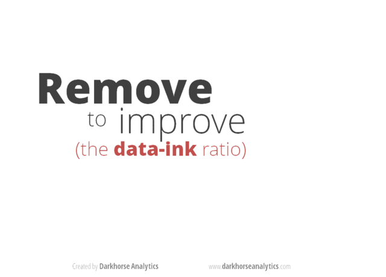
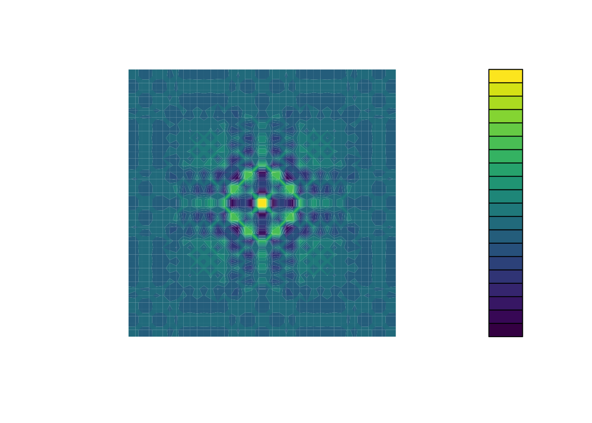

---
webr:
  packages: ['tidyverse']
editor:
  mode: source
  code-link: false
---

# Interactive Graphics

## Acknowledgements

This chapter is derived from the R-DAVIS (R-Data Analysis & Visualization In Science) course <https://ucd-cepb.github.io/R-DAVIS/>, which is licensed as follows:

> Content from this course is derived and remixed from many sources in adherence with their respective licensing, the [Creative Commons Attribution licence (CC BY 4.0)](https://creativecommons.org/licenses/by/4.0/). All content is copyrighted to its respective owners.
>
> The source of the content for any particular lesson can be found at the bottom of each lesson's website.
>
> All original content is also licensed under the Creative Commons Attribution license. The full legal text of this license can be found at [https://creativecommons.org/licenses/by/4.0/legalcode](https://creativecommons.org/licenses/by/4.0/legalcode).

Accordingly this chapter is also licensed according the the CC by 4.0 license.

<br>

::: blue
## Learning Objectives

- Learn some basic visualization dos and don'ts
- Learn how to customize color in plots
- Gain a basic understanding of packages `cowplot` and `patchwork` for multi-paneled plots
- Introduction to interactive `plotly` package
:::

**Goals:** To learn how to use R to:

* Make multi-paneled plots
* Make a ggplot2 graph interactive
* Make a more informative pop-up with customized labels
* Make an animated interactive graph
* Make interactive Manhattan and LocusZoom plots
* Create linked interactive plots
* Label outliers
* Avoid overlapping labels
* Create an interactive web app using Shiny

<br>

## Data Visualization in R

There are many tips and tricks that are available for the multitude of visualization packages in R. However, there aren't as many simple rules or suggestions on what actually makes a good visualization. This starts with the "grammar of graphics", which is the fundamental rules or principals which describe an art or science (from Wickham 2010).

> "A good grammar will allow us to gain insight into the composition of complicated graphics, and reveal unexpected connections between seemingly different graphics (Cox 1978)"

Because there are so many options and methods to plot our data in R, we need to think about how we are going to represent the data, how can that data be interpreted visually, and what story it may tell.

A very nice example of this is provided by this animation (created by Darkhorse Analytics, and used in Jenny Bryan's excellent [stat545](http://stat545.com/block015_graph-dos-donts.html) course). It shows how *simplification* can make a big difference in communication.

{fig-alt="Animated GIF showing a cluttered bar chart being progressively stripped of unnecessary elements — including background fill, gridlines, borders, a legend, and redundant axis labels — until only the essential bars and minimal labels remain. Illustrates the principle that simpler visualizations communicate more effectively."}

### Exploration vs. Communication

One thing to consider is what the objective is when creating a visualization or plot. When we build plots for exploratory purposes, we already know what the variables are we are using, and the objective is more about what sort of patterns the data might show. When communicating, the objective is more about providing a stand-alone snapshot which helps others *understand* what you are trying to convey.

### `ggplot2`

While there are many visualization options in R, we believe the most comprehensive and powerful is the `ggplot2` package. Much of the class has used/follows `ggplot`, so here's a little background that might be useful.

- Based on Grammar of Graphics book by Leland Wilkinson hence 'gg'
- Each part of the plot is layered or built upon the other parts (like building legos).
- Consider parts of a `ggplot2` as parts of a house.
  - Data = The materials the house is built from (`ggplot(data=yourdata)`)
  - Plot Type = The structure/design of your house (how will it look?) (`geom_`)
  - Aesthetics = What the exterior looks like, i.e., the paint/decor (`aes()`)
  - Stats = Ways to wire or plumb your house...how to tie your data together, or transform it (`stat_`)

A questions we often get asked when helping students with ggplot figures is, *how can I put two y-axis on my graph?* Short answer, with ggplot, you can't. There is a good reason for this though, which is basically that the creators of ggplot2 believe that duel y-axis are confusing, eaisly misunderstood and not invertible (given a point on the plot space, you can not uniquely map it back to a point in the data space). We agree with this logic, and would urge you to never put two differnt y-axis on the same plot. Instead, make two separate graphs.

## Color

There are so many options in R. It is fun to play around with color, but keep in mind not everyone sees color in the same way, and some folks cannot see certain spectrums of color (i.e., [absence of blue or green receptors is common](https://www.colormatters.com/color-and-vision/what-is-color-blindness)). See below for a example of what colorblindness may do...if you see numbers inside these circles, great, you have some blue/green retinal receptors.

{fig-alt="Ishihara color blindness test plate 1. A circle of dots in shades of orange, red, and green. People with normal color vision can identify a number embedded in the pattern; those with red-green color blindness may see a different number or none at all."} {fig-alt="Ishihara color blindness test plate 3. A second circle of multicolored dots used to detect deficiencies in blue or green color receptors. Viewers with normal vision can perceive a number within the pattern."}

Having said that, [here's a great cheat sheet of colors in R](https://www.nceas.ucsb.edu/~frazier/RSpatialGuides/colorPaletteCheatsheet.pdf), it can be handy when trying to find the correct color or name of a color. Check out this recent Nature perspective piece on [The misuse of colour in science communication](https://www.nature.com/articles/s41467-020-19160-7?utm_source=twitter&utm_medium=social&utm_content=organic&utm_campaign=NGMT_USG_JC01_GL_NRJournals).

### Discrete/Categorical:

For a very nice discussion about color palettes, I recommend [this page](http://www.cookbook-r.com/Graphs/Colors_(ggplot2)/) from the R cookbook folks.

Additionally, check out the great [ggthemes](https://cran.r-project.org/web/packages/ggthemes/vignettes/ggthemes.html) package, which has many options. One I find very helpful is using `scale_color_colorblind()`, which if you have 8-9 categories, may be a nice way to display your data.

### Continuous: [`viridis`](https://cran.r-project.org/web/packages/viridis/vignettes/intro-to-viridis.html)

The `viridis` package is an excellent set of colors that better represent your data, are easier to read for those with colorblindness, and they also tend to print fairly well in grayscale.

Take a look at the [vignette online](https://cran.r-project.org/web/packages/viridis/vignettes/intro-to-viridis.html)!

An example:

{fig-alt="Demonstration of the viridis color palette showing multiple continuous color scales (including viridis, magma, inferno, and plasma), each progressing from dark to light in a perceptually uniform gradient. These palettes are designed to be readable by people with color vision deficiencies and to reproduce well in grayscale."}

### Customizing color pallettes in ggplot

The viridis color pallettes have been built into ggplot so that you can call upon them using the scale_fill_viridis_ or scale_color_viridis_ functions. Note that whether or not you use the fill or color scale function depends on which aesthetic you set in your plot. The functions also have extenstions depending on the kind of variable that you want to color: scale_fill_viridis_*d* is for discrete variables while scale_fill_viridis_*c* is for continous variables. Within the function, you can specify which virids pallette to use: A-D.

In this example we fill in our bars with the cut vairable in the diamond dataset, a categorical variable with 5 groups.

```{r, echo=T, eval=T}
#| fig-alt: "Stacked bar chart of the ggplot2 diamonds dataset. The x-axis shows diamond clarity grades from I1 (lowest) to IF (highest). The y-axis shows count up to approximately 13,000. Bars are stacked by cut quality (Fair, Good, Very Good, Premium, Ideal) and colored using the viridis plasma palette, ranging from vivid purple-blue for Fair through brilliant orange to yellow-green for Ideal."
library(ggplot2)
ggplot(diamonds, aes(x = clarity, fill = cut)) + 
  geom_bar() +
  theme(axis.text.x = element_text(angle=70, vjust=0.5)) +
  scale_fill_viridis_d(option = "C") +
  theme_classic()
```

## Visualization Tips {.tabset .tabset-fade}

This information isn't meant to be comprehensive, but at minimum, it may provide some guidance when you are creating plots and figures.

### Visualization Do's

The most basic tip is keep it simple! Stick with a clean and clear message, what is your plot/figure trying to get across? Data visualization is effective when it is simple, and repackages data into a visual story that is easy to understand.

- Label appropriately and legibly, including axes, and use text to highlight important bits
- Use one color to represent each category, consider colorblind/BW friendly palettes
- Order datasets using logical heirarchy (Make it easy for reader to compare values)
- Use icons when possible to reduce unnecessary labeling
- Pay attention to scale (e.g., start axis at zero not 2.4 to 3.5)
- Include your data/outliers where possible
- Be sure to increase your font size early on, as most journals require a large font size at time of publication.

### Visualization Don'ts

A few things to avoid (which basically relates to keeping it simple):

- Don't try to add too much into one plot...**keep it simple**
- Don't add color uncessarily unless it provides a specific function
- Avoid high contrast colors (red/green or blue/yellow)
- Don't use 3D charts. They can make it hard to discern or perceive the actual information.
- Avoid ornamentation (shadowing, extra illustration, etc)
- Avoid more than 6 categorical colors in a layout unless you looking at continuous data.
- Keep fonts simple (avoid uncessary **bold** or *italicization*)
- Don't try to compare too many categories or data types in one chart

### Examples

#### Scatterplots

One of the best simple plots for examining patterns in data, but very effective. Also used when adding model trend lines.

```{r}
suppressPackageStartupMessages(library(ggplot2))
```

```{r scatterplots-1}
#| fig-alt: "Base R index plot of iris petal width (cm) on the y-axis for all 150 observations indexed on the x-axis. Two rough clusters are visible: a lower cluster of small values (setosa) and an upper cluster of larger values (versicolor and virginica)."
plot(x=iris$Petal.Width) # single variable
```

```{r scatterplots-2}
#| fig-alt: "Base R scatterplot with iris petal width (cm) on the x-axis and petal length (cm) on the y-axis. Points form two distinct groups: a tight cluster at the lower left for setosa and a diffuse upper-right cluster for versicolor and virginica, indicating a strong positive relationship."
plot(x=iris$Petal.Width, y=iris$Petal.Length) # multiple variables
```

```{r scatterplots-3}
#| fig-alt: "ggplot2 scatterplot of iris petal width (x-axis) versus petal length (y-axis) with all 150 points shown in a single color. The plot reveals a strong positive association and two well-separated clusters."
ggplot() + geom_point(data=iris, aes(x=Petal.Width, y=Petal.Length))
```

```{r scatterplots-4}
#| fig-alt: "ggplot2 scatterplot of iris petal width versus petal length with semi-transparent filled circles colored by species. Setosa forms a tight cluster at small petal dimensions; versicolor occupies intermediate values; virginica has the largest petal measurements. The three species are visually distinct."
ggplot() + geom_point(data=iris, aes(x=Petal.Width, y=Petal.Length, fill=Species), pch=21, size=3, alpha=0.5)
```

#### Lineplots

Comparing relative change in quantities across a variable like time. Note the change when we avoid facetting each line independently.

```{r lineplots-1}
#| fig-alt: "Base R multi-panel time series plot of four European stock market indices — DAX (Germany), SMI (Switzerland), CAC (France), and FTSE (UK) — from approximately 1991 to 1998. Each index is shown in a separate panel with its own y-axis scale. All four show a general upward trend over the period."
plot(EuStockMarkets)
```

```{r lineplots-2}
#| fig-alt: "ggplot2 line chart overlaying all four European stock market indices (DAX, SMI, CAC, FTSE) on a single set of axes from 1991 to 1998, each drawn in a different color. The chart highlights correlated upward trends across all markets, with DAX and SMI reaching the highest values by 1998."
suppressPackageStartupMessages(library(tidyverse))
EuStockMarkets_df <- data.frame(as.matrix(EuStockMarkets), date=as.numeric(time(EuStockMarkets)))
EuStockMarkets_long <- gather(data = EuStockMarkets_df, key = "Market", value="value", 1:4)
ggplot() + geom_line(data=EuStockMarkets_long, aes(x=date, y=value, color=Market))
```

#### Barplots

Comparing totals across multiple groups. Notice legibility when you stack the bars.

```{r barplots-1}
#| fig-alt: "Base R bar chart displaying iris petal length for all 150 individual observations as consecutive gray bars of varying heights. No grouping or color is applied. Bar heights range roughly from 1 to 7 cm."
# code adpated from https://www.analyticsvidhya.com/blog/2015/07/guide-data-visualization-r/
suppressPackageStartupMessages(library(viridis))
barplot(iris$Petal.Length)
```

```{r barplots-2}
#| fig-alt: "Base R bar chart of iris sepal lengths for all 150 observations. Bars cycle through three colors from the viridis magma palette (dark purple, medium pink, and light yellow-orange) without any grouping legend. Bar heights range from approximately 4.3 to 7.9 cm."
barplot(iris$Sepal.Length,col  = viridis(3, option = "A"))
```

```{r barplots-3}
#| fig-alt: "Stacked base R bar chart showing the frequency of iris sepal length values. Each bar represents a unique sepal length value, and colored segments show the proportion contributed by each of the three species (setosa, versicolor, virginica) using the viridis magma palette."
barplot(table(iris$Species,iris$Sepal.Length),col  = viridis(3, option = "A"))
```

<br> <br>

## Non-visual data interaction

Discussions of visualization so far have taken for granted that visualization is accessible to everyone, but researchers and audiences alike are not all sighted. RStudio is behind on blind accessibility, but some packages can provide text descriptions and sonification/audification of plots to improve accessibility for non-visual data interaction.

The `BrailleR` package ([read more here](https://r-resources.massey.ac.nz/BrailleRInAction/)), has a `VI()` function that wraps around plots and provides a text-description output. We can use the VI wrapper to interact with our plots from a textual perspective and identify what information is missing. Such text can also be used as alt-text when publishing this material. What could we do to our plot to improve the text description?

```{r, echo=T, eval=T, warning= F, message = F}
#install.packages("BrailleR")
library(BrailleR)

barplot <- ggplot(diamonds, aes(x = clarity, fill = cut)) + 
  geom_bar() +
  theme(axis.text.x = element_text(angle=70, vjust=0.5)) +
  scale_fill_viridis_d(option = "C") +
  theme_classic()

VI(barplot)
```

The `sonification` package's `sonify` function can be used to represent data in audio form, where the x-axis can span sound across time, so that the length of time a sound plays follows the data long the x-axis from left to right; the y-axis can be expressed as pitch, so that the pitch of the sound matches to the values of the data (lower value = lower pitch).

```{r, echo = F, eval = T, warning= F, message = F}
library(sonify)
library(seewave)
sonif <- sonify(iris$Petal.Width, play=FALSE)
savewav(sonif, file = "sw.width.sound.wav")
```

One variable can be used as an input to hear the distribution. For instance this univariate plot of iris petal width visually looks like this:

```{r, echo=T, eval=T, warning= F, message = F}
#| fig-alt: "Base R index plot of iris petal width (cm) on the y-axis for all 150 observations. Two distinct horizontal bands of points are visible: a lower band near 0.1–0.6 cm (setosa) and an upper band from approximately 1.0–2.5 cm (versicolor and virginica). This plot accompanies a sonification example in which the same distribution is represented as audio."
plot(iris$Petal.Width)
```

Using `sonify` instead of plot, the distribution of iris petal width sounds like this:

```{r, echo = T, eval = T, warning= F, message = F}
#install.packages("sonify")
library(sonify)
sonify(iris$Petal.Width, play = FALSE)
```

If you try this on your computer it should play autmatically, buy on the website you can listen below:

<audio controls>
  <source src="sw.width.sound.wav" type="audio/wav">
</audio>

```{r, echo = F, eval = T, warning= F, message = F}
sonif <- sonify(x = iris$Petal.Width, y = iris$Petal.Length, play=FALSE)
savewav(sonif, file = "sw.width.length.sound.wav")
```

Two variables can be used as input to hear the relationship between continuous variables. For instance this bivariate plot of iris petal length and petal width visually looks like this:

```{r, echo=T, eval=T, warning= F, message = F}
#| fig-alt: "Base R scatterplot of iris petal width (x-axis) versus petal length (y-axis) for all 150 observations. A strong positive correlation is visible, with two clusters: a tight group of small-petaled setosa specimens and a larger spread of versicolor and virginica. This plot accompanies a sonification example in which petal width is mapped to time and petal length to pitch."
plot(x = iris$Petal.Width, y = iris$Petal.Length)
```

And using `sonify`, sounds like this:

```{r, echo=T, eval=T, warning= F, message = F}
sonify(x=iris$Petal.Width, y = iris$Petal.Length, play = FALSE)
```

<audio controls>
  <source src="sw.width.length.sound.wav" type="audio/wav">
</audio>

## Publishing Multi-paneled Plots

### `cowplot`

A few excellent options exist for creating multi-paneled plots for publications. The first and foremost is a package by Claus Wilke called [`cowplot`](https://cran.r-project.org/web/packages/cowplot/vignettes/introduction.html). With `cowplot`, it's possible to quickly combine existing `ggplots`, creating publication quality plots. See the vignette for more options, but here's a quick example from the vignette below:

```{r, echo = F, warning = F, message = F}
detach("package:BrailleR", unload=TRUE)
```

```{r cowplot, echo=T, eval=T, message=FALSE}
library(cowplot)
```

```{r cowplot-grid}
#| fig-alt: "Three-panel figure assembled with cowplot in a 2-by-2 grid. Panel A (top-left): scatterplot of city versus highway fuel economy from the mpg dataset, points colored by number of cylinders. Panel B (top-right): scatterplot of iris sepal length versus petal length, points filled by species. Panel C (bottom, spanning full width): stacked bar chart of diamond clarity by cut, colored with the viridis plasma palette."
# make a few plots:
plot.diamonds <- ggplot(diamonds, aes(clarity, fill = cut)) + 
  geom_bar() +
  theme(axis.text.x = element_text(angle=70, vjust=0.5))

plot.cars <- ggplot(mpg, aes(x = cty, y = hwy, colour = factor(cyl))) + 
   geom_point(size = 2.5)

plot.iris <- ggplot(data=iris, aes(x=Sepal.Length, y=Petal.Length, fill=Species)) +
  geom_point(size=3, alpha=0.7, shape=21)

# use plot_grid
panel_plot <- plot_grid(plot.cars, plot.iris, plot.diamonds, labels=c("A", "B", "C"), ncol=2, nrow = 2)
panel_plot
```

```{r cowplot-fixed}
#| fig-alt: "Three-panel figure with a custom size layout using cowplot's draw_plot. Panel A (labeled, bottom half, full width): scatterplot of iris sepal length versus petal length by species. Panel B (labeled, top-left quarter): scatterplot of mpg city versus highway fuel economy colored by number of cylinders. Panel C (labeled, top-right quarter): stacked bar chart of diamond clarity by cut."
# fix the sizes draw_plot
fixed_gridplot <- ggdraw() + draw_plot(plot.iris, x = 0, y = 0, width = 1, height = 0.5) +
           draw_plot(plot.cars, x=0, y=.5, width=0.5, height = 0.5) +
           draw_plot(plot.diamonds, x=0.5, y=0.5, width=0.5, height = 0.5) + 
  draw_plot_label(label = c("A","B","C"), x = c(0, 0.5, 0), y = c(1, 1, 0.5))
fixed_gridplot
```

### `patchwork`

The `patchwork` R library can also be used to assemble multi-part figures.

Getting Started with Patchwork: <https://patchwork.data-imaginist.com/articles/patchwork.html>

```{r, message=FALSE}
library(patchwork)
```

```{r patchwork-sidebyside}
#| fig-alt: "Two plots placed side by side using the patchwork package. Left: stacked bar chart of diamond clarity (x-axis, I1 to IF) by cut quality, filled with viridis colors. Right: scatterplot of city fuel economy versus highway fuel economy from the mpg dataset, points colored by number of cylinders."
plot.diamonds + plot.cars
```

```{r patchwork-layout}
#| fig-alt: "Three-panel patchwork figure. Top row: the diamond clarity bar chart on the left and the mpg fuel economy scatterplot on the right. Bottom row: a full-width scatterplot of iris sepal length versus petal length, with points filled by species. Layout uses the patchwork formula (plot1 | plot2) / plot3."
(plot.diamonds | plot.cars) / plot.iris
```

Tags can be easily added to a set of plots, using the `plot_annotation` command:

```{r}
#| fig-alt: "Three-panel patchwork figure with automatic annotation tags A, B, and C added via plot_annotation(tag_levels = 'A'). Panel A: stacked bar chart of diamond clarity by cut. Panel B: scatterplot of mpg city versus highway fuel economy by number of cylinders. Panel C: full-width scatterplot of iris sepal length versus petal length colored by species."
plots <- (plot.diamonds | plot.cars) / plot.iris
plots + plot_annotation(tag_levels = 'A')
```

## Saving Figures and Plots

A plot you created with ggplot or another plotting package can be saved as .JPEGS (or .tiff, .img, etc) onto you. For any ggplot objects, we recommend using `ggsave`.

First, let's create a new folder in this project called `figures`. Let's save all the figures we create to that folder. `ggsave` will default to saving the last plot you created, however, we think it is always a good idea to specify exactly which plot you want saved. To do that, we have to save our plot as an object.

```{r, eval = F}
ggsave("figures/gridplot.png", fixed_gridplot)
```

#### With `ggsave` you can save images as

- .png, .jpeg, .tiff, .pdf, .bmp, or .svg

#### Other arguments of `ggsave`

- `scale` can scale the image (multiplicative scaling factor)
- `width` and `height` let you specify the size of the image in `units` that you specify
- `dpi` can change the quality of the image; for publication graphs we suggest over 700 dpi

```{r, eval = F}
ggsave("figures/gridplot.png", fixed_gridplot, width = 6, height = 4, units = "in", dpi = 700)
```

## Interactive `plotly` graphics

The `plotly` R package provides an interface to the open source JavaScript graphing library `ploty.js`.

`ggplotly()`: transform a ggplot2 object into a plotly object.  
`plot_ly()`: directly create a plotly object.

See the book "Interactive web-based data visualization with R, plotly, and shiny" by Carson Sievert at <https://plotly-r.com>

See also the comparison [here](https://jtr13.github.io/spring19/community_contribution_group17.html)

### How to use `plotly`

The package `plotly` is an excellent, easy to use resource that allows you to quickly create interactive, web-based figures. We have used plotly to illustrate patterns in data to collaborators, to visualize patterns in our data during the pre-analysis stage, and even impress with "fancy" graphics during a conference talk!

Let's try plotly together using some of the `iris` data:

```{r, warning = F, message =F}
library(plotly)
library(crosstalk)
library(htmlwidgets)

plot.iris <- ggplot(data=iris, aes(x=Sepal.Length, y=Petal.Length, fill=Species)) +
  geom_point(size=3, alpha=0.7, shape=21)

plotly::ggplotly(plot.iris) #it's as simple as that!
```

### Customizing labels

It is possible to customize the labels using the ggplot2 text aesthetic to provide more information.

Example at this link: <https://www.littlemissdata.com/blog/interactiveplots>

Here's an example of how to generate a custom tool tip containing information from several columns of the input `iris` data frame:

```{r}
plot.iris <- ggplot(data=iris, 
   aes(x=Sepal.Length, y=Petal.Length, fill=Species,
   text=paste("Species: ",Species,"\n",
              "Sepal Length: ",Sepal.Length,"\n",
              "Sepal Width:  ",Sepal.Width,"\n",
              "Petal Length: ",Petal.Length,"\n",
              "Petal Width:  ",Petal.Width,"\n",
              sep=""))) +
  geom_point(size=3, alpha=0.7, shape=21)

plotly::ggplotly(plot.iris, tooltip="text")
```

### Animated Interactive Plots

Animated interactive plots using the 'frame' attribute.

Example at this link: <https://slcladal.github.io/motion.html>

See also the `gganimate` R package <https://cran.r-project.org/package=gganimate>.

### Interactive Linked Plots

The `plotly` package, when combined with the `crosstalk` package, supports linked plots, where selection of points in one plot highlights them in the other plots. This is known as "linked brushing".

```{r}
library(plotly)
library(crosstalk)
d <- SharedData$new(iris)
p <- GGally::ggpairs(d, aes(color = Species), columns = c(1,2,3))
highlight(ggplotly(p), on = "plotly_selected")
```

### Interactive Manhattan plots

The `manhattan` command from the `qqman` R package provides an easy way to make Manhattan plots, but interactive annotated plots can be made using `ggplotly`.

Also note that for static plots, the `ggrepel` R package can be used to annotate with SNP names.

See this web page for examples at this [link](https://r-graph-gallery.com/101_Manhattan_plot.html).

In particular, note in the examples:

- How `ggrepel` is used for the annotation.
- The interactive version made with `plotly`.

See also LocusZoom at <http://locuszoom.org>

### CRAN Task View: Dynamic Visualizations and Interactive Graphics

For an overview of R packages that are useful in this area, see the CRAN Task View: Dynamic Visualizations and Interactive Graphics at <https://cran.r-project.org/web/views/DynamicVisualizations.html>

## Labelling outliers

Example of labeling outliers (from Deducer tutorial video)

```{r, warning = FALSE}
#| fig-alt: "Scatterplot of infant mortality rate (deaths per 1000 live births, y-axis) across four world regions (x-axis) using the Leinhardt dataset. Point size is proportional to per-capita income. Countries with infant mortality above 300 are labeled by name using geom_text, with some labels overlapping nearby points."
library(carData)
data(Leinhardt)
# Set up a new column that only has non-blank names 
# for the outliers:
Leinhardt$outName <- ifelse(Leinhardt$infant > 300, rownames(Leinhardt), "")
ggplot() +
  geom_point(aes(x = region, y = infant, size = income),
             data = Leinhardt,
             alpha = 0.6598) +
  geom_text(
    aes(x = region, y = infant, label = outName),
    data = Leinhardt,
    size = 3.0,
    hjust = 1.2052,
    vjust = 0.5155,
    parse = FALSE
  )
```

## Avoiding overlapping labels

The `ggrepel` R package can be used to avoid overlapping labels in plots.

> "Text labels repel away from each other, away from data points, and away from edges of the plotting area"

See <https://ggrepel.slowkow.com/#examples> for examples.

```{r, warning = FALSE}
#| fig-alt: "Scatterplot of infant mortality rate by world region from the Leinhardt dataset, with point size proportional to per-capita income. Outlier country names are positioned using the ggrepel package so that labels are automatically nudged away from each other and from data points, eliminating the overlap seen in the previous plot."
library(ggrepel)
ggplot() +
  geom_point(aes(x = region, y = infant, size = income),
             data = Leinhardt,
             alpha = 0.6598) +
  geom_text_repel(
    aes(x = region, y = infant, label = outName),
    size = 3.0,
    data = Leinhardt
  )
```

## Shiny

### Example 1

Shiny is an R library for building interactive web apps with R.

Example at this link:
<https://shiny.rstudio.com/tutorial/written-tutorial/lesson1/>

### Tutorial

Heinsberg LW, Koleck TA, Ray M, Weeks DE, Conley YP. Advancing Nursing Research Through Interactive Data Visualization With R Shiny. Biological Research For Nursing. 2022 Aug 26;109980042211211. DOI: <https://doi.org/10.1177/10998004221121109>

Example at this link:
<https://lwheinsberg.shinyapps.io/NurShinyExample1/>

GitHub repository:
<https://github.com/lwheinsberg/NurShiny>

### Example 2

The BDNF DNA Methylation Map:

<https://lwheinsberg.shinyapps.io/BDNF_DNAmMap/>

Interactively explore the data assembled during the writing of this systematic review:

Treble-Barna A, Heinsberg LW, Stec Z, Breazeale S, Davis TS, Kesbhat AA, Chattopadhyay A, VonVille HM, Ketchum AM, Yeates KO, Kochanek PM, Weeks DE, Conley YP. Brain-derived neurotrophic factor (BDNF) epigenomic modifications and brain-related phenotypes in humans: A systematic review. Neurosci Biobehav Rev. 2023 Apr;147:105078. PMID: 36764636 PMCID: PMC10164361 DOI: <https://doi.org/10.1016/j.neubiorev.2023.105078>

## Acknowledgments

This lesson is adapted from the Software Carpentry: R for Reproducible Scientific Analysis [Vectors and Data Frames materials](http://data-lessons.github.io/gapminder-R/03-data-types-subsetting.html) and the Data Carpentry: R for Data Analysis and Visualization of Ecological Data [Exporting Data materials](http://www.datacarpentry.org/R-ecology-lesson/03-dplyr.html).